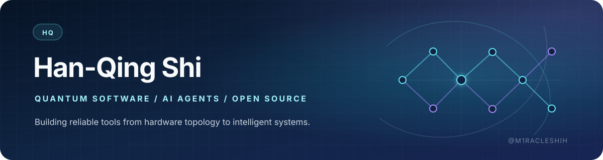

**Software engineer · Quantum computing · AI agents · Open source**

## Hi, I'm Han-Qing 👋

I'm a software engineer based in China. Much of my work sits close to **quantum measurement and control**: representing chip topology, reasoning about calibration workflows, and turning research concepts into software that engineers can inspect and use.

I also build and study **AI agents**. I'm most interested in agents as dependable systems—not just demos—with explicit boundaries, observable behavior, stable failure semantics, tests, and interfaces that remain useful in real workflows.

## Right now

- 🤝 Contributing upstream to **[Hermes Agent](https://github.com/NousResearch/hermes-agent)** across scheduling, persistent goals, provider compatibility, messaging, and reliability.
- 🧪 Building the **[OpenAI Agents SDK Learning Lab](https://github.com/M1racleShih/openai-agents-sdk-learning-lab)** as a practical path from a first agent to a bounded, observable terminal application.
- 🌱 Learning **quantum error correction**, surface codes, and lattice surgery in public through **[Learn QEC](https://github.com/M1racleShih/learn-qec)**.
- 🧭 Exploring geometry-first representations of quantum hardware with **[QArray](https://github.com/M1racleShih/quantum-array)**.

## How I like to build

- Start with a reproducible problem and make the failure mode explicit.
- Keep changes reviewable, then validate them at the real platform or provider boundary.
- Treat tests, observability, and documentation as part of the product—not cleanup work.
- Prefer small, dependable tools over abstractions that are flexible only on paper.

## Open source

I contribute when a concrete user problem crosses a platform, provider, or tooling boundary. Recent upstream work spans **[Hermes Agent](https://github.com/NousResearch/hermes-agent)**, **[NextAI Translator](https://github.com/nextai-translator/nextai-translator)**, **[Codex Desktop Linux](https://github.com/ilysenko/codex-desktop-linux)**, and NVIDIA's **[Quantum Calibration Agent Blueprint](https://github.com/NVIDIA/Quantum-Calibration-Agent-Blueprint)**.

GitHub's native activity overview below keeps the live record. You can also [browse my public pull requests](https://github.com/search?q=is%3Apr+author%3AM1racleShih+-user%3AM1racleShih&type=pullrequests).

## Working with

  
  
  
  
  

## Say hello

Ask me about quantum chip topology, QEC learning, dependable agent systems, or developer tooling. If something I build is useful—or could be better—the simplest way to reach me is through the relevant repository or here as **[@M1racleShih](https://github.com/M1racleShih)**.
