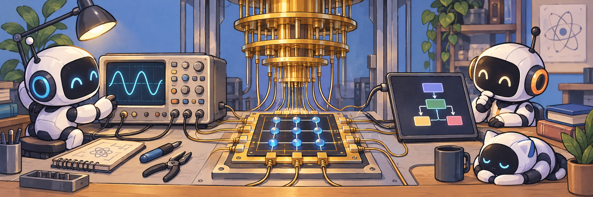

**Software engineer · AI agent tooling · Quantum measurement & control**

## Hi, I'm Han-Qing 👋

I'm a software engineer based in China, building **dependable tools for AI coding agents**: project-scoped skills, model routing, terminal observability, and ways to bring work into everyday workflows.

My background is in **quantum measurement and control**, from chip topology to calibration workflows. Across both domains, I care about explicit boundaries, observable behavior, and software that engineers can inspect, test, and use.

## Right now

| Project | What I'm building |
| --- | --- |
| **[dynamic-skills](https://github.com/M1racleShih/dynamic-skills)** | A versioned local skill pool with explicit, pinned project selections for Codex, Claude Code, Kimi Code, and Pi. Available on PyPI; currently Alpha. |
| **[pi-hud](https://github.com/M1racleShih/pi-hud)** | A terminal HUD for Pi with context and tool activity, optional session usage accounting, and opt-in provider quota visibility. |
| **[Qingniao](https://github.com/M1racleShih/qingniao)** | A local model gateway with explicit routing and a Claude Code launcher. Runnable core; early development, with no public registry release yet. |
| **[conv-docs](https://github.com/M1racleShih/conv-docs)** | A read-only mobile viewer for explicitly published workspace documents, with token authentication, temporary previews, and exclusion rules. |

Recent merged upstream work includes [workspace-scoped skill discovery in cc-connect](https://github.com/chenhg5/cc-connect/pull/1842), [Kimi conversation history in herdr-remote](https://github.com/dcolinmorgan/herdr-remote/pull/81), and [an MCP SDK security update in pi-web-access](https://github.com/nicobailon/pi-web-access/pull/522).

## Learning & research

- 🧪 **[OpenAI Agents SDK Learning Lab](https://github.com/M1racleShih/openai-agents-sdk-learning-lab)** — a hands-on path from a first agent to a bounded, observable terminal application.
- 🌱 **[Learn QEC](https://github.com/M1racleShih/learn-qec)** — learning quantum error correction, surface codes, and lattice surgery in public.
- 🧭 **[QArray](https://github.com/M1racleShih/quantum-array)** — exploring geometry-first representations of quantum chip topology.

## How I like to build

- Start with a reproducible problem, clear boundaries, and explicit failure behavior.
- Keep changes reviewable; check them against real agent hosts, provider interfaces, and recovery scenarios.
- Build tests, observability, and documentation alongside the tool.

## Working with

  
  
  
  
  

## Say hello

Ask me about quantum chip topology, QEC learning, dependable agent systems, or developer tooling. If something I build is useful—or could be better—the simplest way to reach me is through the relevant repository or here as **[@M1racleShih](https://github.com/M1racleShih)**.
